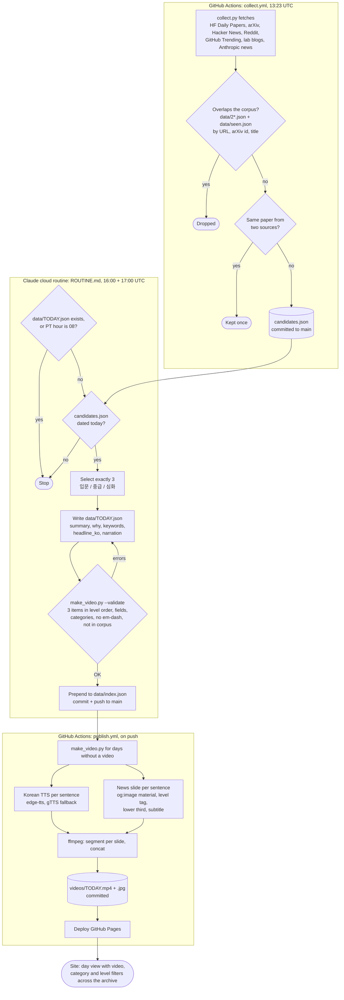

# HUB

Daily AI/ML brief for a university student: every morning at 09:00 PT, three picks (입문, 중급, 심화) summarized in Korean, plus a Korean news-style video of them.

Live: https://hysk-cmd.github.io/hub/

## Agent workflow

Three pieces, all in the cloud. GitHub Actions does everything that needs the open internet (collecting, TTS, og:images, deploying). The Claude routine does the judgment: picking 3 and writing the Korean summaries and narration. Its sandbox has no open internet, so it only reads what Actions committed.

## Files

| File | What it does |
|---|---|
| `ROUTINE.md` | Instructions the daily Claude routine follows. Change selection rules and the schema here. |
| `collect.py` | Pulls candidates and removes anything already in the corpus. stdlib only. `python collect.py --check` self-tests. |
| `make_video.py` | Validates a day file and renders the news video. `--validate FILE`, `--check`. |
| `.github/workflows/collect.yml` | Morning run of `collect.py`, commits `candidates.json`. |
| `.github/workflows/publish.yml` | On push: renders missing videos, commits them, deploys Pages. |
| `data/YYYY-MM-DD.json` | One day: 3 items. `data/index.json` lists the days. |
| `data/seen.json` | Extra URLs to never show again (items retired from the site). |
| `videos/` | Daily MP4 + poster JPG. |
| `index.html` | The site. No build step. Preview with `python -m http.server`. |

Local deps for the video: `pip install edge-tts gTTS pillow imageio-ffmpeg`.
