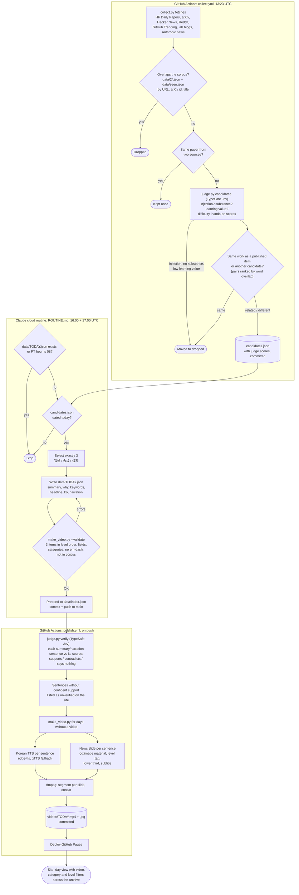

# HUB

Daily AI/ML brief for a university student: every morning at 09:00 PT, three picks (입문, 중급, 심화) summarized in Korean, plus a Korean news-style video of them.

Live: https://hysk-cmd.github.io/hub/

## Agent workflow

Three pieces, all in the cloud. GitHub Actions does everything that needs the open internet (collecting, TTS, og:images, deploying). The Claude routine does the judgment: picking 3 and writing the Korean summaries and narration. Its sandbox has no open internet, so it only reads what Actions committed.

## Files

| File | What it does |
|---|---|
| `ROUTINE.md` | Instructions the daily Claude routine follows. Change selection rules and the schema here. |
| `collect.py` | Pulls candidates and removes anything already in the corpus. stdlib only. `python collect.py --check` self-tests. |
| `judge.py` | TypeSafe judgments where code would guess: candidate screen/scores/semantic dedupe, and sentence-level fact check of summaries. Thresholds at the top of the file. Skips cleanly without `TYPESAFE_API_KEY`. `--check` self-tests. |
| `make_video.py` | Validates a day file and renders the news video. `--validate FILE`, `--check`. |
| `.github/workflows/collect.yml` | Morning run of `collect.py` + `judge.py candidates`, commits `candidates.json`. |
| `.github/workflows/publish.yml` | On push: `judge.py verify` + renders missing videos, commits them, deploys Pages. |
| `data/YYYY-MM-DD.json` | One day: 3 items. `data/index.json` lists the days. |
| `data/seen.json` | Extra URLs to never show again (items retired from the site). |
| `videos/` | Daily MP4 + poster JPG. |
| `index.html` | The site. No build step. Preview with `python -m http.server`. |

Local deps: `pip install edge-tts gTTS pillow imageio-ffmpeg typesafe-sdk`. The Actions workflows need a `TYPESAFE_API_KEY` repository secret.

### TypeSafe judgment policy (first tuned on 2026-09-28 data)
- Candidate dropped if injection > 0.7, substance < 0.5, or learning value < 0.9 (of 3; lowered from 1.0 so tool launches scoring ~0.99 survive). On 2026-09-28 this removed 6 non-study HN stories, a partnership announcement and a customer story, and kept every paper plus 3 real HN finds.
- Duplicate pairs: nearest level of different / related / same decides (no threshold). A paper's own code release counts as "same".
- A summary sentence passes only as "supports" with confidence ≥ 0.8; everything else is listed as unverified, never silently published as fact.
- Raw probabilities stay in `candidates.json` (`judge`), for kept and dropped items alike, so thresholds can be retuned without new calls.
- Answers are typed (`response_model` subclasses of `SystemOneResponse`), and requests retry on 429/5xx/timeouts (`RETRY` in `judge.py`).
- If TypeSafe is down: candidates fail open (unjudged items are kept and committed, the routine still runs); verify fails closed (nothing is marked, re-run the publish workflow to retry).
